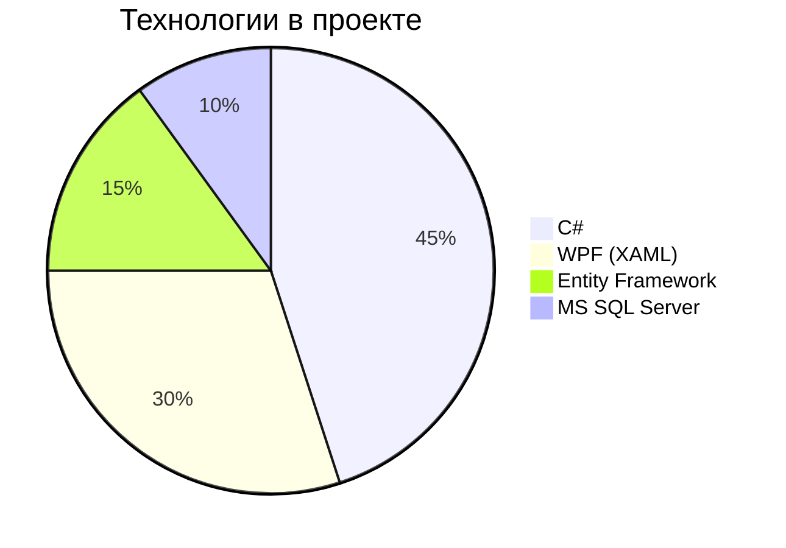

# 🏗️ BuildAPP – WPF-приложение для строительных расчетов  

**BuildAPP** – это десктопное приложение на C#/WPF для автоматизации строительных расчетов, управления проектами и составления смет.  

[](https://learn.microsoft.com/ru-ru/dotnet/csharp/)
[](https://learn.microsoft.com/ru-ru/dotnet/desktop/wpf/)
[](LICENSE)

## 🔍 Основные возможности (из кода ветки Kobzar)
- **Расчет строительных материалов** (бетон, кирпич, перекрытия)
- **Управление проектами** (CRUD-операции)
- **Визуализация данных** через WPF-графики
- **Работа с базой данных** (Entity Framework)

## 🛠 Технологический стек


## ⚙️ Установка и запуск
1. **Требования**:  
   - .NET 6.0+  
   - Visual Studio 2022  
   - SQL Server (или LocalDB)

2. **Сборка**:
```bash
git clone https://github.com/Mamblz/BuildAPP.git
cd BuildAPP
git checkout Kobzar
dotnet restore
dotnet build
```


## 📂 Структура проекта
```
BuildAPP/
├── BuildAPP.Core/      # Бизнес-логика
├── BuildAPP.Data/      # Репозитории + EF
├── BuildAPP.UI/        # WPF-интерфейс
└── BuildAPP.Tests/     # Юнит-тесты
```
